# Little Fighter 1 — English Edition

<p align="center">
  
</p>

### LF1 English

A fan-made English translation and quality-of-life mod of **Little Fighter 1** (1995), the original DOS beat-'em-up by [Marti Wong](http://www.martiwong.com). The game's menus, fonts, and text have been re-lettered for English players, and `MODS.COM` — a lightweight TSR included alongside `PLAY.COM` — adds optional cheats, gameplay tweaks, and MIDI background music.

> **Recommended:** The smoothest way to play is **[RetroArch](https://www.retroarch.com/)** with the **DOSBox-Pure** core. It handles the DOS environment, gamepads, save states, shaders, and MIDI out of the box — just point it at `PLAY.COM` and go. See [Running the Game](#running-the-game) below.
>
> **Background music** requires a General-MIDI SoundFont. This repo ships [`weedsgm3.sf2`](./weedsgm3.sf2) (≈55 MB) — point your MIDI synth (FluidSynth / DOSBox-Pure / RetroArch) at it. See [SoundFont setup](#soundfont-setup-for-midi-music).

> From [lf2.net](https://lf2.net/lf1.html) (Marti Wong, creator):
>
> I started to write my first Little Fighter game in the summer of 1995. It is my first game written in C language. In this game, you run with a bunch of kids who just want to fight. You choose to be one of 11 characters, each character has 3 special moves and then you participate in an all out fight. In the game, you can play one on one, team matches or elimination tournament matches. There is up to 8 fighters simultaneously on screen controlled by up to 3 human players. The game modes include the usual championships as well as fighters divided into 2, 3 or 4 groups.

---

## Table of Contents

- [Screenshots](#screenshots)
- [Running the Game](#running-the-game)
- [SoundFont setup (for MIDI music)](#soundfont-setup-for-midi-music)
- [Controls](#controls)
- [Moves](#moves)
- [Mods — `mods.cfg`](#mods--modscfg)
- [Cheats / Hotkeys](#cheats--hotkeys)
- [Credits](#credits)

---

## Screenshots

<p align="center">
  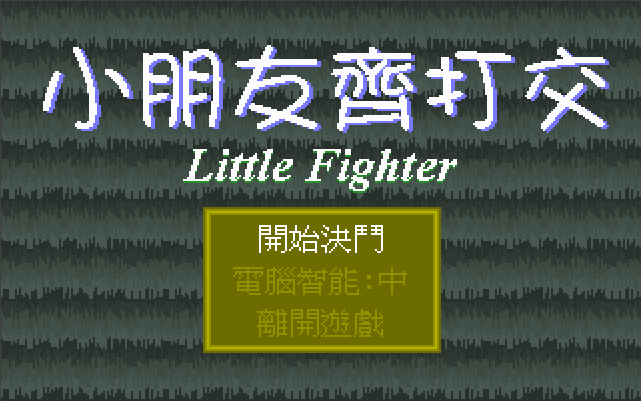
  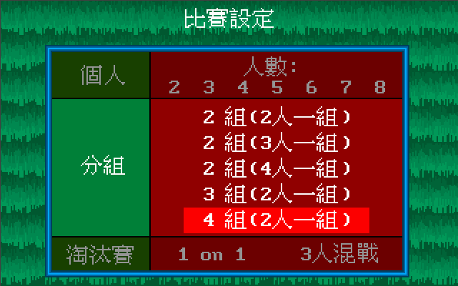
  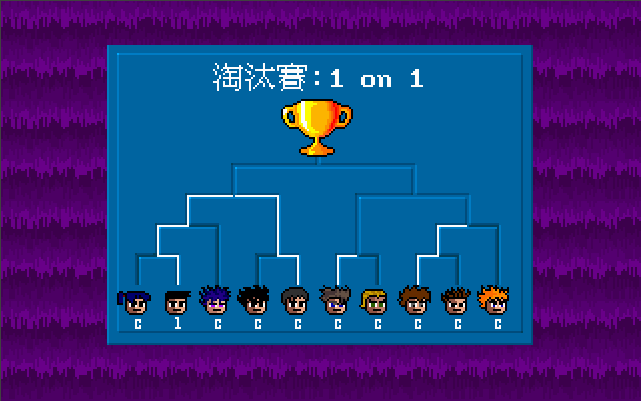
  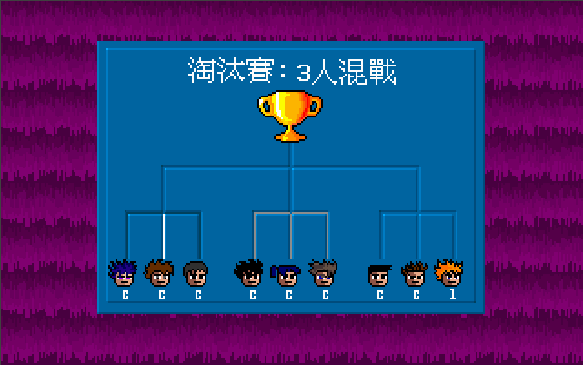
  <br/>
  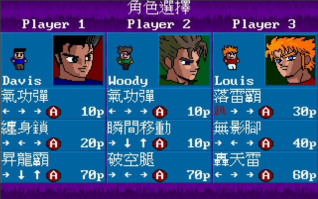
  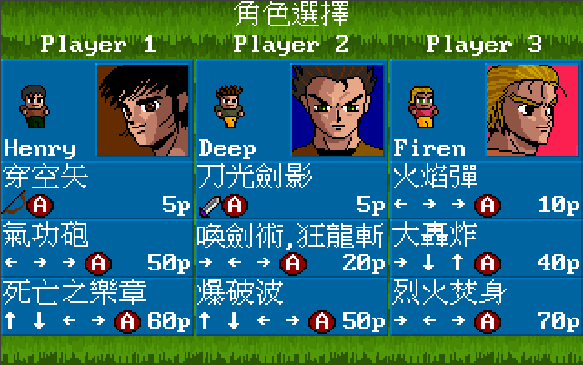
  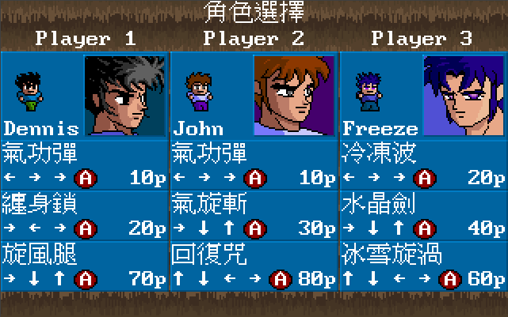
  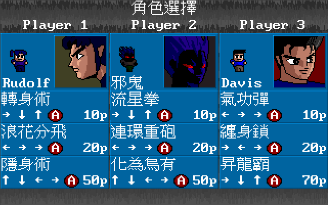
  <br/>
  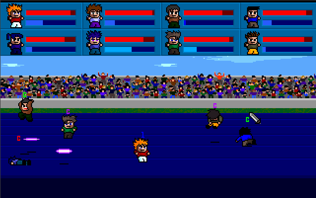
  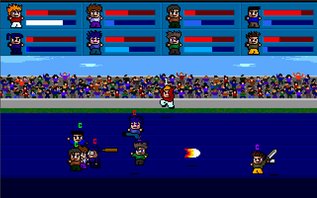
  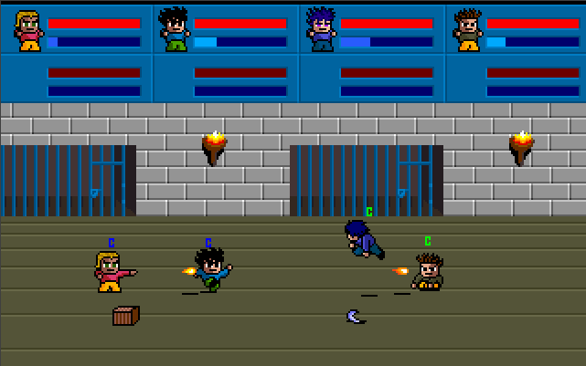
  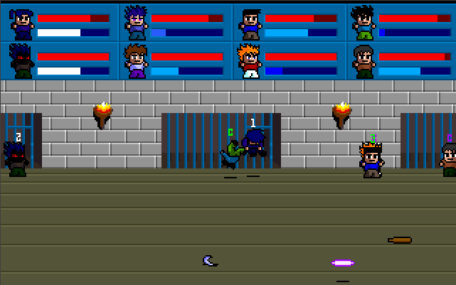
  <br/>
  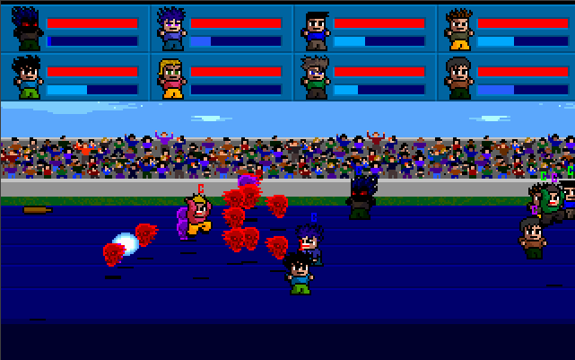
  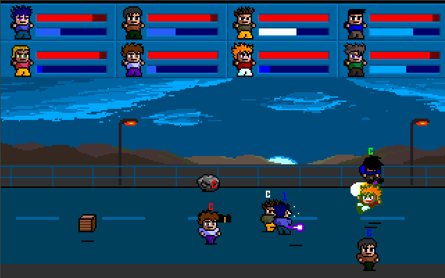
  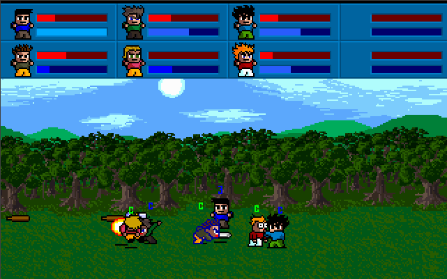
  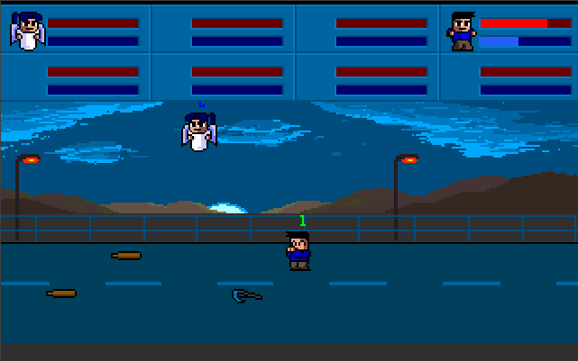
  <br/>
  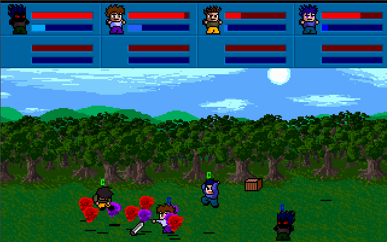
  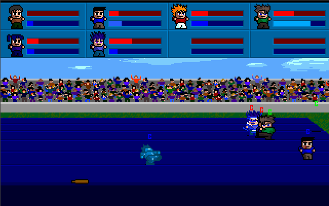
</p>

<sub>Screenshots courtesy of [lf2.net/lf1.html](https://lf2.net/lf1.html).</sub>

---

## Running the Game

Little Fighter 1 is a real-mode DOS program, so you need a DOS host.

### Recommended: RetroArch + DOSBox-Pure

The **best way to run this game is [RetroArch](https://www.retroarch.com/) with the [DOSBox-Pure](https://docs.libretro.com/library/dosbox_pure/) core.** Why:

- Works identically on macOS, Windows, Linux, Steam Deck, and handhelds.
- First-class gamepad support with per-player input remapping (great for LF1's up-to-3-player local multiplayer).
- Built-in save states, rewind, shaders (CRT filters look fantastic), and a built-in MT-32/FluidSynth MIDI stack.
- No messing with `mount`, `autoexec`, or cycles — just point it at `PLAY.COM`.

**Setup:**

1. Install **RetroArch** from <https://www.retroarch.com/>.
2. In RetroArch, open **Online Updater → Core Downloader** and install **DOSBox-Pure**.
3. *(Optional but recommended)* Configure MIDI music — see [SoundFont setup](#soundfont-setup-for-midi-music) below.
4. **Load Content → Start Core** and pick `PLAY.COM` from this repo. (Or on macOS, just double-click `Play Little Fighter (RetroArch).command`, which does this for you.)

### Alternative: DOSBox Staging

If you'd rather run DOSBox directly, install [DOSBox Staging](https://dosbox-staging.github.io/) and from the repo root run:

```bash
dosbox -conf dosbox.conf
```

`dosbox.conf` mounts the repo as `C:`, auto-runs `PLAY.COM`, and enables FluidSynth for MIDI using the bundled [`weedsgm3.sf2`](./weedsgm3.sf2) SoundFont. On macOS you can instead double-click `Play Little Fighter.command`.

### Bare-metal DOS

Just run `PLAY.COM` (or `DOSBOX.BAT`). `MODS.COM` is loaded by `PLAY.COM` on startup; you do not need to run it separately.

---

## SoundFont setup (for MIDI music)

When `bgm=1` in [`mods.cfg`](#mods--modscfg), Little Fighter streams a MIDI soundtrack via the DOS timer. That MIDI has to be rendered into audio by *something* — either your DOS host's built-in MIDI synth or an external one. This repo includes a General-MIDI SoundFont you can use for that:

- **[`weedsgm3.sf2`](./weedsgm3.sf2)** (~55 MB) — ships at the repo root.

### In RetroArch / DOSBox-Pure (recommended)

1. Copy (or symlink) **`weedsgm3.sf2`** into RetroArch's system SoundFont folder:
   - **macOS:** `~/Library/Application Support/RetroArch/system/`
   - **Windows:** `<RetroArch>\system\`
   - **Linux:** `~/.config/retroarch/system/`
2. Launch the game in RetroArch.
3. Open the in-game menu (default `F1` in RetroArch) → **Options** (for the DOSBox-Pure core) → set **MIDI Output** to **FluidSynth** (or `"Use SoundFont"`).
4. If the core asks, select `weedsgm3.sf2` as the SoundFont.

### In DOSBox Staging / vanilla DOSBox

The included `dosbox.conf` is already wired up:

```ini
[midi]
mididevice = fluidsynth

[fluidsynth]
soundfont = weedsgm3.sf2
```

As long as `weedsgm3.sf2` is in the repo root (it is), MIDI will just work. If you want to use a different SoundFont, change the `soundfont=` line to its path.

### Using your own SoundFont

Any General-MIDI `.sf2` file works. Popular alternatives include *GeneralUser GS*, *FluidR3_GM*, and *Arachno SoundFont*. Replace `weedsgm3.sf2` (or update the `soundfont=` path in `dosbox.conf` / your RetroArch config) and restart the game.

> **Tip:** If music doesn't play even though `bgm=1`, your MIDI device isn't hooked up to a synth. Press `F11` in-game to toggle music on/off for debugging, and double-check the SoundFont path in your host.

---

## Controls

| | Player 1 | Player 2 | Player 3 |
| --- | --- | --- | --- |
| **Up** | `W` | `I` | `8` |
| **Left / Right** | `A` / `D` | `J` / `L` | `4` / `6` |
| **Down** | `X` | `,` | `2` |
| **Attack** | `S` | `K` | `5` |
| **Jump** | `Tab` | `Space` | `0` |

- `F10` — end the current battle
- `Esc` — exit to menu

---

## Moves

Each character has **3 special moves**. The number after the colon is the MP cost. The icons below read left-to-right as the input sequence;  = Attack,  = Jump,  /  /  /  = directions.

> The  direction assumes your character is facing right — mirror the left/right inputs when facing the other way.

---

### 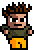 &nbsp; DEEP

| Fireball &nbsp; (5 MP) | Charge &nbsp; (20 MP) | Bomb &nbsp; (50 MP) |
| :---: | :---: | :---: |
| 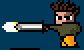 | 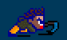 | 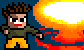 |
| Sword&nbsp;+&nbsp; |  |  |

### 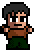 &nbsp; HENRY

| Arrow &nbsp; (5 MP) | Blast &nbsp; (50 MP) | Flute &nbsp; (60 MP) |
| :---: | :---: | :---: |
| 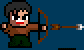 | 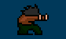 | 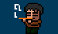 |
| Bow&nbsp;+&nbsp; |  |  |

### 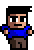 &nbsp; DAVIS

| Ball &nbsp; (10 MP) | Grab &nbsp; (20 MP) | Uppercut &nbsp; (70 MP) |
| :---: | :---: | :---: |
| 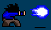 | 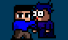 | 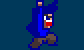 |
|  |  |  |

### 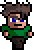 &nbsp; WOODY

| Ball &nbsp; (10 MP) | Teleport &nbsp; (10 MP) | Launch &nbsp; (70 MP) |
| :---: | :---: | :---: |
| 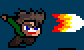 | 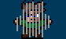 | 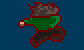 |
|  |  |  |

### 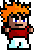 &nbsp; LOUIS

| Airpunch &nbsp; (30 MP) | Airkick &nbsp; (40 MP) | Blast &nbsp; (60 MP) |
| :---: | :---: | :---: |
|  | 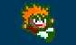 | 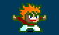 |
|  |  |  |

### 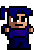 &nbsp; RUDOLF

| Teleport &nbsp; (10 MP) | Shuriken &nbsp; (20 MP) | Invisible &nbsp; (50 MP) |
| :---: | :---: | :---: |
| 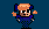 | 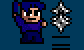 | 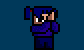 |
|  |  |  |

### 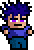 &nbsp; FREEZE

| Iceball &nbsp; (20 MP) | Sword &nbsp; (40 MP) | Cyclone &nbsp; (60 MP) |
| :---: | :---: | :---: |
| 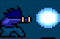 | 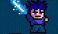 | 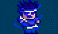 |
|  |  |  |

### 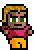 &nbsp; FIREN

| Fireball &nbsp; (10 MP) | Explode &nbsp; (40 MP) | Charge &nbsp; (70 MP) |
| :---: | :---: | :---: |
| 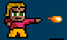 | 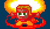 | 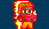 |
|  |  |  |

### 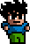 &nbsp; DENNIS

| Ball &nbsp; (10 MP) | Grab &nbsp; (20 MP) | Spinkick &nbsp; (70 MP) |
| :---: | :---: | :---: |
|  |  |  |
|  |  |  |

###  &nbsp; JOHN

| Ball &nbsp; (10 MP) | Disk &nbsp; (30 MP) | Healing &nbsp; (80 MP) |
| :---: | :---: | :---: |
|  |  |  |
|  |  |  |

###  &nbsp; JULIAN (Boss — press `F1` to unlock)

| Charge &nbsp; (10 MP) | Skulls &nbsp; (20 MP) | Big Bang &nbsp; (50 MP) |
| :---: | :---: | :---: |
|  |  |  |
|  |  |  |

<sub>Character sprites, move animations, and button icons courtesy of [Little Fighter Empire](https://www.lf-empire.de/lf1-empire/information/characters).</sub>

---

## Mods — `mods.cfg`

Gameplay tweaks are controlled by a plain text file, **`mods.cfg`**, in the same folder as `PLAY.COM`. Open it in any text editor, set the options you want, save, then launch the game — the values are baked into `MODS.COM` at startup (so editing the file while the game is running has no effect; quit and relaunch).

Each option is a `key=value` pair. Most are on/off flags where **`0` = off** and **`1` = on**. Lines beginning with `#` are comments.

### Options

| Option | Default | Values | Description |
| --- | :---: | :---: | --- |
| `unlock_julian` | `0` | `0` / `1` | Make Julian selectable from the character screen without having to press `F1` first. |
| `balanced_julian` | `0` | `0` / `1` | Disable Julian's HP regeneration so he's fair in mirror matches / FFAs. |
| `free_run` | `0` | `0` / `1` | Running no longer drains MP. |
| `free_jump` | `0` | `0` / `1` | Jumping no longer drains MP. |
| `free_supers` | `0` | `0` / `1` | Special moves cost 0 MP. Overrides `cheap_supers`. |
| `cheap_supers` | `0` | `0` / `1` | Special moves cost half their normal MP. |
| `spawn_weapons` | `1` | `0` – `3` | Weapon drop rate: `0` = off, `1` = normal, `2` = 2×, `3` = 3×. |
| `all_weapons` | `0` | `0` / `1` | Bow, Shuriken, Bomb, and Ice Sword also fall from the sky during fights. |
| `fast_mp` | `0` | `0` / `1` | 2× MP regeneration rate. |
| `no_mp_on_hit` | `0` | `0` / `1` | Landing a super hit no longer grants MP to the attacker (stops infinite loops). |
| `easy_supers` | `0` | `0` / `1` | Single-key supers: `Q`/`E`/`Z` (P1), `U`/`O`/`M` (P2), `Num7`/`Num9`/`Num1` (P3). |
| `practice` | `0` | `0` / `1` | CPU opponents stand still — use for combo practice. |
| `fix_camera` | `1` | `0` / `1` | Prevent players from walking off-screen. |
| `gore` | `0` | `0` / `1` | Enable the original gore death frame (head falls off). |
| `game_speed` | `18.2` | `18.2` – `200` | PIT timer rate in Hz. `18.2` is normal DOS speed; higher = faster gameplay. |
| `vsync` | `1` | `0` / `1` | Wait for vertical retrace before drawing (reduces tearing). |
| `bgm` | `1` | `0` / `1` | Enable MIDI background music. Press `F11` in-game to mute/unmute. Requires a MIDI synth with a SoundFont — see [SoundFont setup](#soundfont-setup-for-midi-music). |

### Example

To play a fast, chaotic "everyone's a boss" free-for-all:

```ini
unlock_julian=1
balanced_julian=1
free_run=1
free_jump=1
fast_mp=1
spawn_weapons=3
all_weapons=1
game_speed=24
```

### How it works

`MODS.COM` is a small DOS TSR built by `build_mods_com.py`. When `PLAY.COM` starts, it loads `MODS.COM`, which reads `mods.cfg`, patches the game's runtime in memory, and installs an `INT 08` handler that drives the optional MIDI music (streamed from `SYS/FUSION.BGM` and `SYS/TRANS.BGM`). End users don't need Python or the build script — everything is pre-built.

---

## Cheats / Hotkeys

In addition to `mods.cfg`, the original game has a few built-in debug hotkeys (all require holding `F1`):

| Key | Effect |
| --- | --- |
| `F1` | Unlock Julian on the character-select screen |
| `F1` + `0` | Change background |
| `F1` + `[` | Full HP for Player 1 |
| `F1` + `]` | Full HP for Player 2 |
| `F1` + `\` | Full HP for Player 3 |
| `F1` + `-` | Drop weapons (including dynamite / shuriken / bow) |
| `F1` + `=` | Delete all weapons |
| `F2` + *number* | Switch control to a different character |
| `F10` | End the current battle |
| `F11` | Toggle background music (when `bgm=1`) |

---

## Credits

- **Little Fighter 1** (1995) — created by [Marti Wong](http://www.martiwong.com). Official site: <https://lf2.net/lf1.html>.
- **Reference documentation and art** — [Little Fighter Empire](https://www.lf-empire.de/lf1-empire): controls, cheats, and the character/move GIFs reproduced in this README.
- **English translation, `MODS.COM`, and build tooling** in this repo — the little-fighter-1-english contributors.
- **SoundFont** — `weedsgm3.sf2` (Weeds GM3), public-domain General MIDI SoundFont by Clement Voillequin.

This repository distributes a fan translation/modification of a freeware game. All rights to Little Fighter 1 remain with its original creator.
